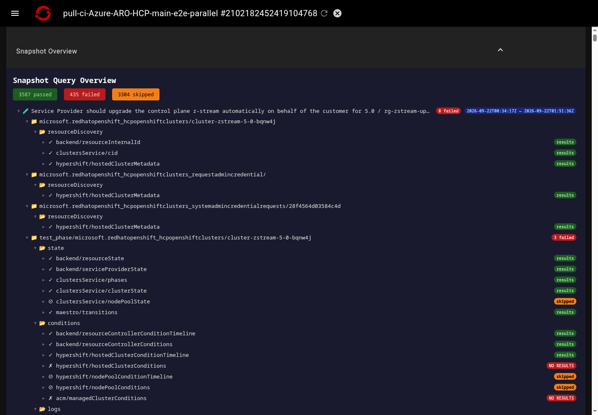
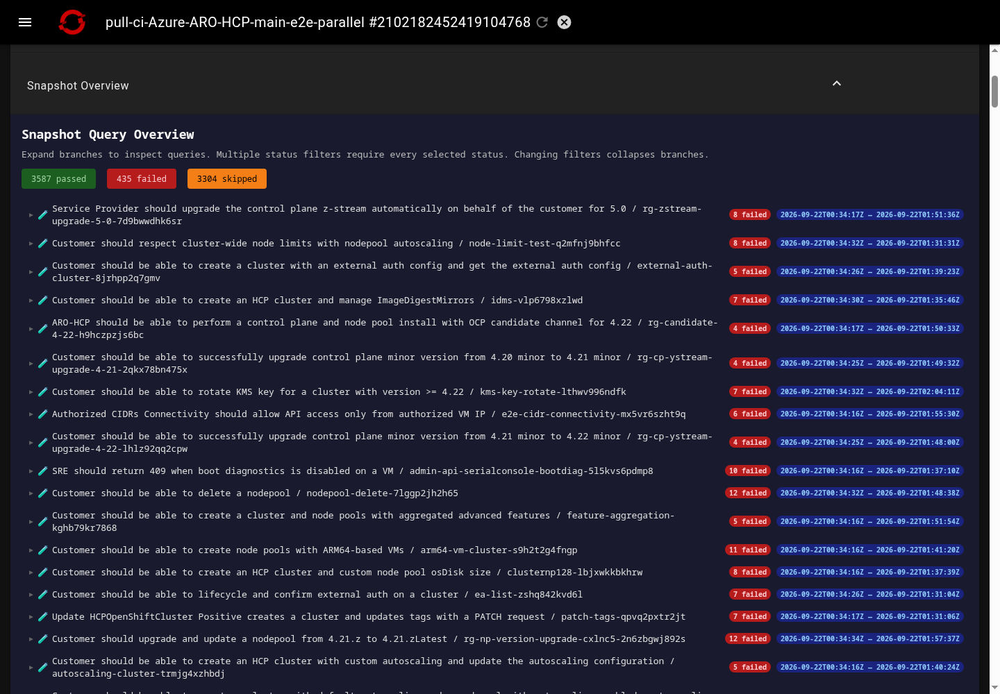
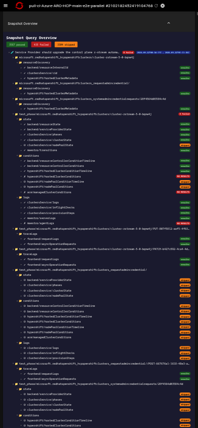
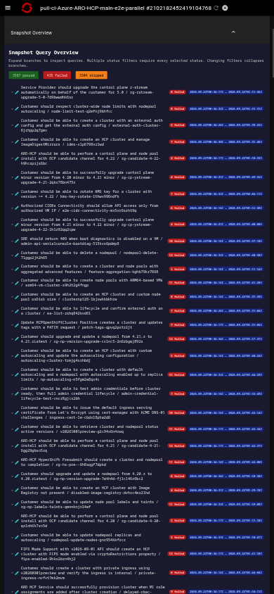

# Deck Report Performance Evidence

Before/after Snapshot Overview screenshots for the public [Prow job](https://prow.ci.openshift.org/view/gs/test-platform-results-public/pr-logs/pull/Azure_ARO-HCP/6359/pull-ci-Azure-ARO-HCP-main-e2e-parallel/2102182452419104768), provided for CONTRIBUTING.md's UI screenshot requirement.

These captures use a frozen replay of the actual Deck page, lenses, scripts, styles, and report artifacts, not a custom approximation of Deck. The after variant replaces the snapshot and test-timing reports and updates the observability resize script; Deck framing and other reports remain unchanged. Both variants receive identical frozen assets/statuses at their original URLs through local browser interception.

## Measurements And Limits

Initial connected elements across all 15 frames: **134,413 -> 15,218 (88.7% fewer)**. Mean browser layout + style duration: desktop **1.023s -> 0.206s**, mobile viewport emulation **0.996s -> 0.203s**, approximately **80% less**. These are combined-report results, not snapshot-only measurements or timings inferred from screenshots.

Measurements average two fresh serial runs per variant/device, sampled at 8s before interactions, in Chrome 143 headless with no CPU/network throttling. Screenshots are from the second paired runs after opening Snapshot Overview. Desktop is 1440 x 1000; mobile viewport emulation is 390 x 844, not a physical-phone benchmark. Deck retains a 980px CSS mobile viewport scaled to the screen, so small mobile text remains.

Replay responses are local and unthrottled: **no server timing, TTFB, live-network, or end-to-end load-time improvement is claimed**. Browser instrumentation adds overhead; local delivery changes event ordering. The earlier live Deck server-response latency is a separate cost.

## Tradeoffs

Snapshot details now start collapsed and are constructed on expansion, reducing initial DOM/layout work but requiring additional clicks. JavaScript is required to construct the deferred details. Large embedded data payloads remain; lazy DOM construction does not eliminate their transfer or parsing costs. These screenshots do not establish an accessibility or mobile-shell fix.

## Screenshots

| Viewport | Before | After |
| --- | --- | --- |
| Desktop |  |  |
| Mobile emulation |  |  |

This evidence-only branch is a standalone root commit containing only this README and four public-job PNGs. It is separate from the source-change branch and is not intended to be merged.
