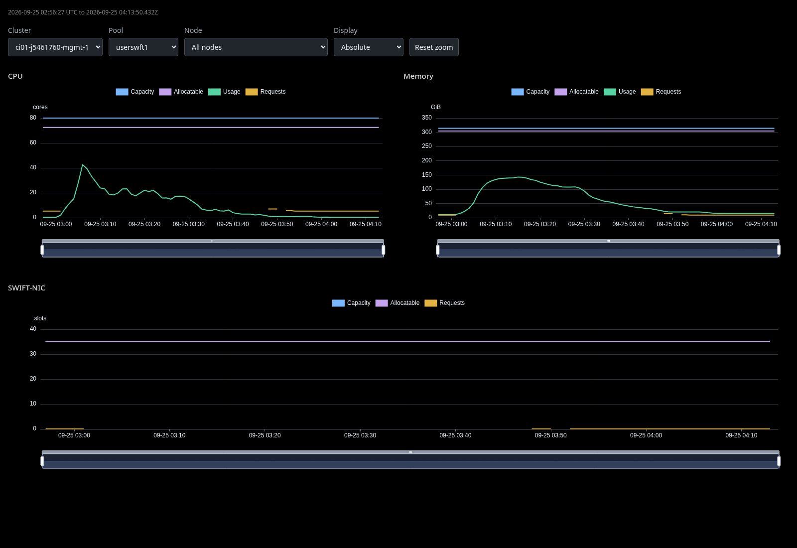
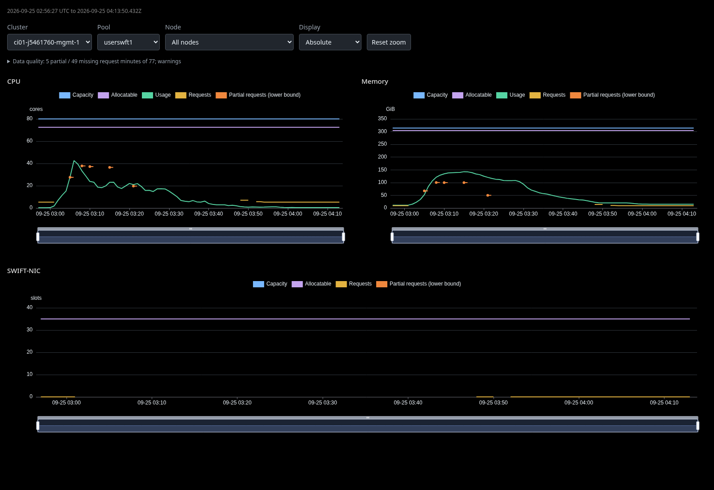
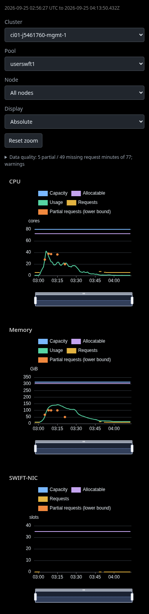

# Partial Resource History Screenshot Evidence

Scope: cluster `ci01-j5461760-mgmt-1`, pool `userswft1`, all nodes, absolute units. Desktop images use a 1600x1100 viewport; the mobile image is a full-page capture at 390px wide.

- `before-desktop.png`: the actual original CI Resource History HTML, extracted unchanged from the report's `TABS` array and rendered with cached ECharts.
- `after-desktop.png` and `after-mobile.png`: the updated renderer with lower-bound CPU and memory request points conservatively recovered from only five stored peak snapshots. These are NOT a fresh collection.

The old collector discarded per-minute partial sums. Only the five saved snapshot times could be recovered for this preview; future new collections retain minute-level partial sums. No SWIFT reconstruction or interpolation was performed. Missing demand remains unknown, and actual requests may be higher than the shown lower bounds.

[Original public CI report](https://storage.googleapis.com/test-platform-results-public/pr-logs/pull/Azure_ARO-HCP/7154/pull-ci-Azure-ARO-HCP-main-e2e-parallel/2103307352265461760/artifacts/e2e-parallel/aro-hcp-gather-observability/artifacts/observability-summary.html)

This standalone orphan evidence branch contains only this README and three screenshots. Images show already-public CI resource names, not credentials or tokens. No report HTML, collected data, source code, or product history is published here.

## Before

## After Desktop

## After Mobile

